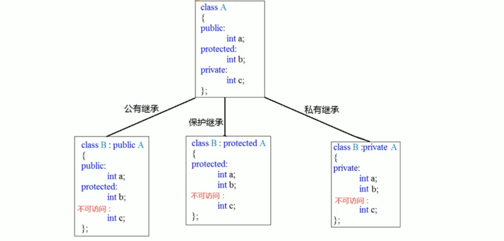

<center><b><div style = "font-size: 40px">C++ 常用概念</div></b></center>

## Part One C++ 基础

## Ⅰ C++ 基础

#### 枚举类型

##### 定义及声明

```c++
enum week {Sun, Mon, Tue, Wed, Thu, Fri, Sat};
//枚举常量Sun,Mon,Tue,Wed,Thu,Fri,Sat的值分别为0、1、2、3、4、5、6

enum week {Sun=7, Mon=1, Tue, Wed, Thu, Fri, S at};
//枚举常量Sun,Mon,Tue,Wed,Thu,Fri,Sat的值分别为7、1、2、3、4、5、6

week weekday1, weekday2;

enum {Sun,Mon,Tue,Wed,Thu,Fri,Sat} weekday1, weekday2;
//类型与变量同时定义（甚至类型名可省）
```

- 枚举类型不能输入，可以输出，输出的是变量的整数值
- 不能直接将常量赋给枚举变量     color1=1;
- 能以标识符形式表示，而不能是整型、字符型
- 枚举变量之间不能相互赋值
- 枚举变量的输入输出一般都采用switch语句将其转换为字符或字符串
- 枚举类型数据的其他处理也往往应用switch语句，以保证程序的合法性和可读性


#### **常量表达式**

- 在编译时得到结果的常量

```c++
常量表达式:
const int a = 10;
constexpr b = a + 10; 

不是常量表达式:
int c = 10;
const int d = c + 10;
constexpr int e = c + 10; // error
```

*数组长度只能用常量表达式定义 


#### 常用内置函数

**exit(0)**：退出程序

**rand()**:  返回从0到最大随机数的任意整数。返回1 ~ 100 之间的整数：rand() % 100 + 1

**system("cls")**：清屏

**system("pause")**：暂停程序，打印 “Press any key to continue . . .”

**vscode中文乱码**：chcp 65001


### 内存分区模型

c++程序执行时，内存大方向分成不同区域。不同区域存放的数据，赋予**不同的生命周期**，有更大的编程灵活性。

#### 程序运行前

程序编译后，形成exe可执行程序，**未执行该程序前**，内存分为两个区域

##### **代码区**

- 由操作系统进行管理
- 存放函数体二进制代码
- 共享性，对于频繁执行的程序，有一份代码即可
- 只读性，防止应用程序意外修改代码

##### **全局区（静态区）**

- 程序结束后由系统释放
- 存放全局变量，静态变量，常量
- 区域细分
  - [全局变量，静态变量（static）]
  - 常量区  [字符串常量，const 修饰的全局变量（全局常量）]


#### 程序运行后

##### **栈区**（stack）

- 由编译器自动分配释放 
- 存放函数参数值，局部变量
  - 函数不要返回局部变量地址
- 操作方式类似于数据结构中的栈


##### **堆区**（heap） 

- 一般由程序员分配释放， 若程序员不释放，程序结束时由操作系统回收 
- 与数据结构中堆是两回事，分配方式类似于链表


#### New 操作符

- 用来在堆区开辟数据，需要用 delete 手动释放
- 用 new 创建的数据，会返回对应类型指针。
- 语法：`new 数据类型`

```c++
//创建整形数据
int *p = new int(10);
delete p;

//创建数组
int *arr = new int[10];		
//int *arr = new int(10);		//也可以
arr[0] = 1;
delete[] arr;
```


### 宏与头文件

\#pragma once

- 由编译器提供保证，有的编译器不支持
- 不能保证内容相同的两个文件不重复编译
- 防止名字冲突


\#ifndef，#define，#endif

- 所有支持C++语言的编译器上都有效
- 依赖于头文件宏名不能冲突
- 保证同一个文件不会被包含多次
- 保证内容完全相同的两个文件，不会被同时包含
- 缺点：如果不同头文件的宏名冲突，可能导致头文件存在，编译器却找不到声明


**例**

一个文件名为 library.h

```c++
#ifndef _LIBRARY_H_
#define _LIBRARY_H_
...
#endif
```


###  位运算


#### 左移，右移运算符

- 将数值转化为二进制，进行移动
- 左移一位 `<< 1` 相当于乘二，左移 n 位 `<< n` 相当于乘 2^n^ 。左移可能使正数变成负数。
- 右移一位 `>> 1` 相当于整除 2

  - 如 3 的二进制为 0011，左移一位 0110 为 6，右移一位 0001 为 1


#### 常用技巧

| ^ 位异或     | & 位与     | \| 位或      | ~ 取反 |
| ------------ | ---------- | ------------ | ------ |
| x ^ 0s  = x  | x & 0s = 0 | x \| 0s = x  | ~x     |
| x ^ 1s  = ~x | x & 1s = x | x \| 1s = 1s |        |
| x ^ x  = 0   | x & x  = x | x \| x  = x  |        |

- x & (x - 1)     去除 x 的二进制中最靠右的 1，如：1111 0100 - 1 = 1111 0011，按位与得到 1111 0000
- x & (-x)         得到 x 的二进制中最靠右的 1，如：1111 0100，取负 0000 1100，按位与得到 0000 0100
- int 中 最小值为 1 >> 31;


### 源码，反码，补码

**机器数**：数的二进制表示，第一位为符号位

**真值**：带符号位的机器数对应的真正数值

**源码**：即机器数

**反码**：正数不变；负数符号位不变，其余取反

**补码**：正数不变；负数符号位不变，其余取反，再加一

| 真值 | 源码      | 反码      | 补码      |
| ---- | --------- | --------- | --------- |
| 1    | 0000 0001 | 0000 0001 | 0000 0001 |
| -1   | 1000 0001 | 1111 1110 | 1111 1111 |

- 采用反码和补码，让符号位参加运算，简化计算机运算设计
- 详解 https://blog.csdn.net/zl10086111/article/details/80907428


### 条件语句

#### switch

```c++
switch(expression){
    case choice1:
    	statement(s);
        break;
    case choice2:
        statement;
        break;
}
```


## Ⅱ 函数

### 1. 声明，实现与参数

- 函数声明与实现可以分开

```c++
//声明
int fun(int a = 10, int b = 10);

//实现
int fun(int a, int b);
{
    return a + b;
}
```

**注意**

- 函数声明和实现，只能有一个有默认参数
- 通常，在函数声明中指定默认参数，并将该声明放在头文件中
- 如果某个参数有默认值，它右边的参数全都要有默认值


#### 占位参数

```c++
void fun(int a, int){ 
    return a;
}
//调用：fun(10, 10),必须有两个参数

void fun(int a, int = 10){ 
    return a;
}
//调用：fun(10)即可
```


### 2. 函数重载

**作用**：函数名可以相同，提高复用性

**条件**：

- 同一作用域下
- 函数名称相同
- 函数参数 **类型**，**个数**，或**顺序**不同

```c++
void fun(){
    cout << "这是fun" << endl;
}

void fun(int a){
    cout << "这是fun a" << endl;
}

void fun(double b){
    cout << "这是fun b" << endl;
}

void fun(int a, double b){
    cout << "这是fun c" << endl;
}

void fun(double a, int b){
    cout << "这是fun d" << endl;
}

int main(){
    fun();				"这是fun"
    fun(10);			"这是fun a"
    fun(2.0);			"这是fun b"
    fun(1, 2.0);		"这是fun c"
    fun(2.0, 1);		"这是fun d"
}
```

**注意**

- 函数的返回值类型不同，不可作为函数重载条件

  

#### 函数重载注意事项

##### 引用作为重载的条件

```c++
void fun(int& a){       //int& a = 10 不合法
    cout << "这是fun" << endl;
}

void fun(const int& a){
    cout << "这是fun const" << endl;
}

int main(){
    int a = 10;
    fun(a);				//这是fun
    fun(10);			//这是fun const
}
```


##### 函数重载碰到默认参数

- 写函数重载时，尽量不要加默认参数

```c++
void fun(int a){
    cout << "这是fun a" << endl;
}

void fun(int a, int b = 10){
    cout << "这是fun a b" << endl;
}

int main(){
    fun(10);				//二义性，不知道调用哪一个函数，报错
}
```


### 3. 特殊用途语言特性

#### 3.1 内联函数 inline

- 返回类型前加 inline，指定函数为内联函数

  ```c++
  //定义内联函数
  inline const shorterString(const string &si, const string &s2){
      return si.size() <= s2.size() ? s1 : s2;
  }
  ```

- **编译时**在调用点内联地展开，避免函数调用时的开销

  ```c++
  cout << shorterString(s1, s2) << endl;
  
  //等价于
  cout << (si.size() <= s2.size() ? s1 : s2) << endl;
  ```

  - 一般函数的调用包含一系列工作：调用前保存寄存器，并在返回时回复；可能需要拷贝实参；程序转向一个新的位置运行。

#### 3.2 constexpr 函数

- 能用于常量表达式的函数
- 返回类型、所有形参都是字面值类型
  - 返回值可以是变量
- 有且只有一条 return 语句
- 被隐式的指定为**内联函数**

```c++
constexpr int scale(int n){
    return 5*n;
}

int i = 2；
int arr[scale(2)];		//正确
int arr[scale(i)];		//错误
```


### 4. 函数指针

- 编译时系统会为函数代码分配存储空间，其首地址称为这个函数的地址
- 函数名表示的就是这个地址
- 函数指针：存储函数代码储存空间首地址
- 函数指针没有 ++ 和 -- 运算

**定义与初始化**

- 定义：`返回值类型 (* 指针变量名) (参数列表);`

```c++
int Func(int x);
int (*p) (int x);
p = Func;
```

**调用**

```c++
int a = (*p)(3);
```


## Ⅲ 类

c++面向对象三大特性：封装，继承，多态

### 1. 封装

**封装的意义**

- 将属性和行为作为一个整体，表现生活中的事物
- 将属性和行为加以权限控制

**语法**     `class 类名{权限：属性/行为};`

**访问权限**

|                           | 类外 | 子类 |
| ------------------------- | ---- | ---- |
| public           公共权限 | √    | √    |
| protected    保护权限     | ×    | √    |
| private         私有权限  | ×    | ×    |

#### struct 与 class

唯一区别：访问权限不同

- struct 默认权限为公有
- class 默认权限为私有


### 2. 初始化和清理

- 每个对象都会有初始设置，和对象销毁前清理数据的设置
- 安全问题
  - 对象没有初始化，状态未知
  - 没有销毁，会造成安全问题


#### 2.1 构造函数和析构函数

- 编译器自动调用
- 编译器默认提供空的构造和析构函数

**构造函数**：创建对象时自动调用，为对象的成员属性赋值

- **语法**：`类名(可以有参数){}`
- 可重载
- 无返回值，不加 void

**析构函数**：销毁对象前自动调用，执行一些清理工作

- **语法**：`类名(){}`
- 不可重载，无参数
- 无返回值，不加 void

```c++
class person(){
    person(){+
        cout << "构造函数";
    }
    ~person(){
        cout << "析构函数"；
    }
};
```

**exit(0) 与析构函数**

- exit(0) 作用：删除所有的静态对象，刷新缓冲，关闭所有的I/O通道，然后结束程序
- 如果对象是全局变量，会调用对象的析构函数
- 如果对象是局部对象，不会调用对象的析构函数，因为不存在栈空间回收问题
- 如果是动态建立的对象，除非手动删除，否则不会调用对象的析构函数


#### 2.2 构造函数的分类及调用

##### 分类方式

- 按参数分为：有参构造，无参构造（默认构造）
- 按类型分为：普通构造，拷贝构造

```c++
class person(){
    person(){}			//无参构造
    
    person(){} = default;  //默认构造函数
    
    person(int a){		//普通构造，有参构造
    	age = a;	
    }
    
    person( const person &p ){	//拷贝构造，有参构造
        age = p.age;
    }
};
```


##### 调用方式

- 括号法

  ```c++
  person p1;			//默认构造函数调用
  person p2(10);		//有参构造函数调用
  person p3(p2);		//拷贝构造函数调用
  person p4();		//*注意*函数声明，不是在创建对象
  
  person(10);			//匿名对象，本行执行完后，系统立即回收
  person(p3);			//person(p3) == person p3;
  ```

- 显示法

  ```c++
  person p1;					//默认构造函数调用
  person p2 = person(10);		//有参构造函数调用
  person p3 = person(p2);		//拷贝构造函数调用
  ```

- 隐式转换法

  ```c++
  person p4 = 10;		//相当于 person p4 = person(10)
  person p5 = p4;		//拷贝构造
  ```

  

#### 2.3 拷贝构造函数调用时机

- 使用已创建完毕的对象，**初始化**一个新对象

- 实例作为**函数参数**

  ```c++
  void work(person p){	//调用拷贝构造函数
      p.age = 100;		//不会改变外部p的 age
  }
  ```

- 实例作为**函数返回值**

  ```c++
  person work(){
      person p1;
      return p1;			//调用拷贝构造函数
  }
  ```

  

#### 2.4 构造函数调用规则

**编译器默认给类添加三个函数**

- 默认构造函数，无参空函数
- 默认析构函数，无参空函数
- 默认拷贝构造函数，拷贝属性值


**构造函数调用规则**

- 用户定义有参构造函数，c++不再提供无参构造函数，但仍提供拷贝构造函数
- 用户提供拷贝构造函数，c++不再提供任何构造函数


#### 2.5 深拷贝与浅拷贝

类中出现指向堆区的指针时，浅拷贝使用析构函数，带来已释放空间重复释放问题

**浅拷贝**：简单的复制拷贝操作，默认拷贝构造函数是浅拷贝

**深拷贝**：堆区重新申请空间，进行拷贝操作

```c++
class Person{
    
    Person(const Person &p){
        _age = _age;					//浅拷贝
        _height = new int(*p, _hight);	//深拷贝
    }
    
    ~Person(){
        if(_height != NULL){
            delete _height;
            _height = NULL;
        }
    }
}
```


#### 2.6 初始化列表

列表初始化属性

```c++
class Person{
private:
    int _A, _B, _C;
public:
    Person(int a, int b, int c) :_A(a), _B(b), _C(c) {}
}

int main(){
    Person p(1, 2, 3);
    Person p = {1, 2, 3};
}
```


#### 2.7 类对象作为类成员

- 先调用类成员（A），再调用自身类（B）
- 先析构自身类（B），再析构类成员（A）

```c++
class A {};
class B{
    A a;
};
```


#### 2.8 静态成员函数

**静态成员**：成员变量和成员函数前加上 static

*静态成员也受访问权限约束

- 静态成员变量
  - 所有对象共享同一份数据
  - 在编译阶段分配内存
  - 类内声明，类外初始化
  - 可以通过对象和类名访问
- 静态成员函数
  - 所有对象共享同一个函数
  - 只能访问静态成员变量
    - 因为无法区分哪个对象改变非静态变量
  - 可以通过对象和类名访问

```c++
class Person{
public:
    static void func(){}
    static int m_A;
    
private:
    static void funx(){}	//类外无法访问
};

int Person::m_A = 100;		//类外初始化

void test(){
    Person p;
    p.m_A = 200;			//更改静态成员变量数据
    p.func();				//通过实例访问
    Person::func();			//通过类名访问
}
```


### 3. C++对象模型和 this 指针


#### 3.1 类的存储方式

**空对象**

- 占用内存空间1字节，用来占位，区分空对象占内存的位置
- 每个空对象都有独一无二的内存地址


**成员变量和成员函数分开储存**

- 非静态成员变量属于类的对象
- 静态成员变量**不**属于类的对象
- 成员函数**不**属于类的对象


#### 3.2 this 指针

**this 指针**

- 指向被调用成员函数所属对象
- 常量指针，指针的指向不可修改
- 隐含在每一个非静态成员函数内，只能在成员函数中使用，不能在静态函数中使用
- 在非静态成员函数内，**成员属性**每次调用都**默认调用** this 指针
- 在成员函数的开始执行前构造的，在成员的执行结束后清除

**用途**

- 形参和成员变量同名时，可用 this 指针区分

- 在类的非静态成员函数中，返回对象本身  `return *this`

  ```c++
  class Person{
      int age;
  public:
      Person(int age){
          this -> age = age; //如果不加this，这里会全部是形参的age，没有成员变量的age
      }
      
      Person &addAge(Person p){	//如果不加引用，返回的是新对象
          this -> age += p.age;
          return *this;			//this解引用，就是对象本身
      }
  };
  
  int main(){
      Person p1(10);
  	Person p2(10);
      
  	p2.addAge(p1).addAge(p1);
  	cout << "p2.age = " << p2.age << endl;
  }
  ```

- 另一种方式解决同名问题

  ```c++
  class Person{
      int m_Age:
  public:
      Person(int age){
          m_Age = age;
      }
  };
  ```

  

#### 3.3 空指针访问成员函数

- 不能访问调用 this 的成员函数
- 用 `if (this == NULL) return;` 增加鲁棒性

```c++
//空指针访问成员函数
class Person {
public:
	int m_Age;
	void ShowClassName() {
		cout << "我是Person类!" << endl;
	}

	void ShowPerson() {
		if (this == NULL) 
			return;
        
		cout << m_Age << endl;
	}
};

int main(){
	Person *p = NULL;
	p->ShowClassName(); //空指针，可以调用成员函数
	p->ShowPerson();  //但是如果成员函数中用到了this指针，就不可以了
}
```


#### 3.4 const 常函数

**常函数**

- 括号后加 const 修饰的函数

- 常函数内不可修改成员变量

- const 实质是修饰 this 指针，让 this 指针指向的值不可修改

- 加 mutable 后在常函数下可修改

  

**常对象**

- 创建对象前加 const
- 常对象只能调用常函数

```c++
class Person{
    int m_A;
    mutable int m_B;
    
    void showPerson() const{	//常函数
        //m_A = 10;   //不可修改
        m_B = 10;
    }
    
    void age(){
        cout << m_A;
    }
}

int main(){
    const Person p();	//常对象
    p.m_B = 10;
    //p.age();		 	//常对象不能调用
}

```


### 4. 友元 friend

让一个函数或者类，访问另一个类中的私有成员

#### 4.1 全局函数做友元

- 在类中复制函数的声明，friend 修饰

```c++
class House{
    friend void goodGay(House *house); //友元声明
};

void goodGay(House *house){
}
```


#### 4.2 类做友元

- 在类中复制类的声明，friend 修饰

```c++
class House{
    friend class Buddy;		//友元声明
}

class Buddy {};
```


#### 4.3 成员函数做友元

- 在类中复制成员函数的声明，friend 修饰
- 必须仔细组织程序结构，以满足声明和定义的彼此依赖关系

```c++
class House;

class Buddy{
public:
    void ask(House *house);
};

class House{
    friend void Buddy::ask(House *house);
    int age = 10;
};

void Buddy::ask(House *house){
    cout << house -> age;
}

int main(){
    House h;
    House *ph = &h;
    Buddy guy;
    guy.ask(ph);
}
```


### 5. 运算符重载

#### 基本概念

**重载的运算符**

- 是具有特殊名字函数
- 函数名由 operater 和要定义的运算符组成 
  - 如： `type operator+()`

**重载运算符参数**

- 一元运算符有一个参数，二元运算符有两个
- 一元运算符默认参数在右侧，加 int 占位符后，参数在左侧
- 无默认实参
- 如果是成员函数，左侧运算对象绑定到隐式的 this 指针上，参数减一

**注意事项**

- 不能重载的运算符 	  `::	.*	 .	 ? :`
- 内置的数据类型不能重载

**函数调用**

- 普通表达式          	    	`a += b;`
- 全局函数的等价调用      `a.operator+=(b);`
- 成员函数的等价调用      `operator+=(a,b);`

**运算符重载与函数重载**

- 重载运算符也可以进行函数重载
- 方便处理不同的数据类型


#### 5.1 + 加号

- 用到的辅助类

  ```c++
  class Person{
  public:
      int m_age = 10;
      Person operator+(Person &p);
  };
  ```


- ##### 成员函数的运算符重载

  ```c++
  Person Person::operator+(Person &p)
  {
      Person temp;
      temp.m_age = m_age + p.m_age;
      return temp;
  }
  ```

  

- ##### 全局函数的运算符重载

  ```c++
  Person operator+(Person &p1, Person &p2){
      Person temp;
      temp.m_age = p1.m_age + p2.m_age;
      return temp;
  }
  ```


- **全局函数重载**

  ```c++
  Person operator+(Person &p1, int age){
      Person temp;
      temp.m_age = p1.m_age + age;
      return temp;
  }
  ```

  
  
  #### 5.2 << 输出输入运算符

**注意事项**

- 减少格式化操作，如打印换行符
- 必须是非成员函数，否则与 iostream 标准库不兼容
  - 成员函数左侧运算对象是类的对象，而非 cout
- IO运算符一般被声明为**友元**

```c++
class Person{
    friend istream &operator>>(istream &is, Person &p);			//友元
    friend ostream &operator<<(ostream &cout, const Person &p);	//友元
    int m_A;
    int m_B;
};
```


**<< 输出运算符**

- 一般情况，第一个形参是非常量 ostream 对象的引用
  - 非常量：向流写入内容会改变它的状态
  - 引用：无法直接复制一个 ostream 对象
- 一般情况，第二个形参是一个常量的引用
  - 常量：打印通常不会改变对象的内容
  - 引用：避免复制实参
- 一般情况，返回值为 ostream 形参的引用

```c++
ostream &operator<<(ostream &cout, const Person &p)
{
	cout << p.m_A << " " << p.m_B;
    return cout;
}
```


**>> 输入运算符**

- 一般情况，第一个形参是 istream 对象的引用
- 一般情况，第二个形参是一个常量的引用
- 一般情况，返回值为 istream 形参的引用

```c++
istream &operator>>(istream &is, Person &p)
{
	is >> p.m_A >> p.m_B;
    if(!is)
        p = Person();
    return is;
}
```


#### 5.3 ++ 递增运算符

```c++
class Person{
    int m_age;
public:
    Person &operator++();
    Person operator++(int);
};
```


**++n 前置递增运算符**

- 返回引用

```c++
Person &Person::operator++(){
    ++this -> m_age;
}
```


**n++ 后置递增运算符**

- 返回创建的值

- 用 **int 作为**函数占位参数

```c++
Person Person::operator++(int){
    Person temp = *this;
    ++*this;
    return temp;
}

Month operator++(Month & month, int){
    Month temp = month;
    month = Month(month + 1);
    return temp;
}
```


#### 5.4 = 赋值运算符

**作用**：避免直接拷贝指针，堆区内存重复释放

- 用到的类，有堆区开辟的内存

```c++
class Person{
public:
    int *m_age;

    Person(int age){
        m_age = new int(age);
    }
    ~Person(){
        if(m_age != NULL){
            delete m_age;
            m_age = NULL;
        }
    }
    
    Person& operator=(Person &p);
};
```


- 实现：返回自身的引用，允许连等操作

```c++
Person& Person::operator=(Person &p){
    if(m_age != NULL){		//检测是否为空指针
        delete m_age;
        m_age = NULL;
    }
    m_age = new int(*p.m_age);
    return *this;
}
```


- 与拷贝构造调用区别

```c++
Person p1;
Person p2 = p1;		//只调用拷贝构造
Person p3;
p3 = p1;			//只调用 = 重载
```


#### 5.5 == 关系运算符

**作用：**比较两个自定义类型对象

**== 与 != 运算符**

```c++
bool operator==(const Person& p1, const Person& p2){
    return p1.age == p2.age && p1.gender == p2.gender;
}

bool operator!=(const Person& p1, const Person& p2){
    return !(p1 == p2);
}
```

**<= 与 >运算符**

```c++
bool operator<=(const Person& p1, const Person& p2){
    return p1.age <= p2.age && p1.gender <= p2.gender;
}

bool operator>(const Person& p1, const Person& p2){
    return !(p1 <= p2);
}
```

**注意事项**

- 相等运算符应该具有传递性，a == b 和 b == c 都为真，则 a == c 也应该为真
- 如果一个类含有判断两对象是否相等的操作，显然应该定义成 ==，而非其他成员函数
- 如果定义了 ==，应该也定义 ! =，对用户比较方便
- **互斥**意义的关系运算符，其中一个应该把工作**委托给另一个**


#### 5.6 [] 下标调用运算符

- 两个参数，自定义类型和 index

```c++
string& Class::operator[](int index){
    return _Arr[index];
}
```


#### 5.7 () 仿函数

- 类重载了函数调用运算符，可以像使用函数一样使用该类的对象
- 称为仿函数，或函数对象

```c++
struct absInt{
    int operator()(int val){
        return val < 0 ? -val : val; 
    }
};
```


**匿名函数对象** / 临时对象

- 执行完当前行就销毁

```c++
int a = -100
a = absInt()(a);
```


**含有状态的函数对象**

- 函数对象可以储存状态，和普通函数比更加灵活

```c++
class PrintString{
public:
    PrintString(ostream &o = cout, char c = ' '): os(o), step(c) {}
    void operator()(const string &s) const 
private:
    ostream &os;
    char step;
};

int main(){
    PrintString printer;
    printer(s);							//在 cour 中打印s，后面接空格
    PrintString errors(cerr, '\n');
    errors(s);							//在 cerr 中打印s，后面接换行符
}
```


**函数对象作为泛型算法的实参**

- for_each 第三个对象是 PrintString 的临时对象

```c++
for_each(vs.begin(), vs.end(), PrintString(cerr, '\n'))
```


##### 谓词

* 返回bool类型的仿函数
* 一元谓词：operator() 接受一个参数
* 二元谓词：operator() 接受两个参数

```c++
struct GreaterFive{
	bool operator()(int val) {
		return val > 5;
	}
};

class MyCompare{
public:
	bool operator()(int num1, int num2)	{
		return num1 > num2;
	}
};
```


### 6. 继承

- 通过继承联系在一起的类，构成一种层次关系
- **基类 base class**：父类，层次关系根部的类
- **派生类 derived class**：子类，继承得到的类
- 多继承：一个子类继承多个父类，实际开发中不建议使用

- 语法  `class 子类 : public 父类1, public 父类2...`


#### 6.1 继承方式

- 公有继承
- 保护继承
- 私有继承




#### 6.2 继承中的对象模型

**派生类对象**

- 派生类对象包含多个组成部分
  - 一个含有派生类自己定义的，非静态成员的子对象
  - 一个基类的，含有所有基类非静态成员的子对象
  - 如果有多个基类，有多个基类子对象

- 基类中私有属性也被子类继承，但被编译器隐藏，子类无法访问


**派生类对象中 基类的组成部分**

- 派生类对象可以当作基类对象使用

- 基类对象的指针和引用，可以绑定在派生类对象的基类部分上

  ```c++
  Base base;
  Son son;
  Base *p = &son;
  Base &r = son;
  ```

- 这种转换称为**派生类到基类**的类型转换，被编译器隐式地执行


**构造顺序**

- 构造父类，构造子类，析构子类，析构父类


#### 6.3 继承中的同名成员处理

- 访问派生类成员：直接调用
- 通过派生类访问基类同名成员：加父类作用域  `a.Base::member();`
- 不能通过参数区别派生类和基类的函数
- 派生类中出现基类中同名函数，会隐藏掉基类中所有同名成员函数

- 多继承基类成员同名，通过加作用域区分

```c++
class father{
public:
    int age = 40;
};

class son : public father{
public:
    int age = 10;
};

int main(){
    son luca;
	luca.age;			// 10
    luca.father::age;	// 40
}
```

**同名静态成员**

- 处理方式与非静态成员一致
- 可通过类名访问 `Son::Base::member();`


#### 6.4 虚继承

**语法**：`class Son : virtual public Base {};`

**作用**：防止发生菱形继承时，基类被复制两份，资源被无意义的浪费

**例子**

```c++
class Animal{
public:
	int m_Age;
};

class Sheep : virtual public Animal {};
class Tuo   : virtual public Animal {};

class SheepTuo : public Sheep, public Tuo {};
```


### 7. 多态

#### 7.1 **基本概念**

**多态**

- 用途：为不同数据类型的实体提供统一的接口
- 应用场景：当类之间存在层次结构，并且通过继承关联时
- C++ 多态：调用成员函数时，会根据调用函数的对象的类型来执行不同的函数


**静态多态**

- 编译阶段确定函数地址，函数地址早绑定
- 包含：函数重载，运算符重载

**动态多态**

- 运行阶段确定函数地址，函数地址晚绑定
- 包含：派生类和虚函数


**动态多态使用**

- 满足条件

  * 有继承关系
  * 子类重写父类中的虚函数
- 调用条件
  - 基类的指针或引用，调用派生类时


#### 7.2 虚函数

- 定义基类时，将希望被派生类覆盖的函数，声明成虚函数
  - 使用指针或者引用调用虚函数时，该调用将被动态绑定
  - 根据指针或引用绑定对象类型不同，调用执行版本不同
- 虚函数必须为非构造函数，非静态函数，可以是析构函数
- 基类的虚函数在派生类中隐式地是虚函数


**语法**

- 语法： `virtual 函数声明`
- 关键字 virtual 只能出现在类内部声明语句之前，不能用于类外函数定义
- 子类中覆盖时，不用写 virtual


**示例**

```c++
class Animal{
public:
	virtual void speak(){
		cout << "Animal" << endl;
	}
};

class Cat :public Animal{
public:
	void speak(){
		cout << "Cat: Miao Miao" << endl;
	}
};

int main(){
	Cat cat;
    Animal *ptr = &cat;
	ptr -> speak();
}
```

**调用：堆区开辟内存**

```c++
int main(){
    Animal *ptr = new Cat();
	ptr -> speak();
}
```

**调用：函数形参**

```c++
void DoSpeak(Animal & animal){
	animal.speak();
}

int main(){
	Cat cat;
    DoSpeak(cat);
}
```


#### 7.3 抽象基类

**纯虚函数**

- 将虚函数设为**纯虚函数**，告诉用户基类中的函数没有实际意义
- 纯虚函数声明语法： `virtual type func() = 0 ;`
- `= 0` 只能出现在声明语句处
- 纯虚函数可以定义，但必须定义在类的外部


**抽象基类**

- 拥有纯虚函数的类，称为抽象基类
- 不能（直接）创建的对象
- 抽象基类复制定义接口，后续其他类可以覆盖该接口
- 子类必须重写纯虚函数，否则也属于抽象类


**示例**

```C++
class Animal{
public:
	virtual void speak() = 0;
};

class Cat :public Animal{
public:
	void speak(){
		cout << "Cat: Miao Miao" << endl;
	}
};

int main(){
    Animal *cat = new Cat;
	cat -> speak();
}
```


#### 7.4 虚析构

- 应用场景：派生类开辟堆区内存，基类析构函数无法释放
- 作用：通过父类指针释放子类对象
- 虚析构语法：`virtual ~类名(){}`


```c++
class Animal{
public:
	virtual void speak() = 0;
    virtual ~Animal(){
        cout << "Animal delete" << endl;
    };
};
```


**纯虚析构**

- 也必须有具体的函数实现
- 只能在类外进行定义

```c++
class Animal{
public:
	virtual void speak() = 0;
    virtual ~Animal() = 0;
};

Animal::~Animal(){
    cout << "Animal delete" << endl;
}
```


**示例**

```c++
class Cat :public Animal{
public:
    int *age = new int(3);
	void speak(){
		cout << "Cat: Miao Miao" << endl;
	}
    
    ~Cat(){
        delete age;
        age = NULL;
        cout << "cat delete" << endl;
    }
};

int main(){
    Animal *cat = new Cat;
	cat -> speak();
    delete cat;
}
```

**输出**

```c++
Cat: Miao Miao
cat delete
Animal delete
```


## Ⅳ 模板

- 模板：建立通用模具，大大提高复用性
- 泛型编程思想，主要利用的技术就是模板
- 两种模板机制：函数模板和类模板


### 1. 函数模板

- 作用：建立一个通用函数
- 通用函数返回值类型和形参类型，可以不指定，用虚拟的类型来代表


#### 1.1 定义与调用

**创建函数模板**

- `template <class T>`
- `template <typename T>`

```c++
template <typename T>
void Swap(T &a, T& b){
    T temp;
    temp = a;
    a = b;
    b = temp;
}
```


**调用函数模板**

- 自动类型推导

```c++
int a = 1, b = 2;
Swap(a, b);
```

- 显式指定类型

```c++
Swap<int>(a, b);
```


**注意事项**

- 如使用自动类型推导，必须推导出一致的数据类型 T
- 如函数无参数，则无法进行自动类型推导，必须显示指定类型 T


#### 1.2 **函数模板与普通函数**

**区别**

- 普通函数调用，可以发生隐式类型转换
- 函数模板调用，用自动类型推导，不会发生隐式类型转换；用显式指定类型，可以发生隐式类型转换


**重载**

- 优先调用普通函数
- 用空模板参数列表，强制调用函数模板 `func< >(a, b);`
- 如果调用普通函数需隐式类型转换，优先调用函数模板

- ###### 尽量不要让同义普通函数和函数模板同时出现


#### 1.3 特殊数据类型

- 如数组，类，无法适用于通用模板
- 为特定的类型，提供具体化模板
- 具体化模板调用，优先于常规模板

```c++
class Person{ };

template <typename T>
void compare(T &a, T& b){ }

template< > void compare(Person& a, Person& b){ }
```


### 2. 类模板


#### 2.1 定义与调用

**定义**

- 在模板参数列表，参数可以指定默认值

```c++
template <class longType, class highType = int>
class Table{
    public:
    Table(longType l, highType h){
        longth = l;
        highType = h;
    }
    
    longType longth;
    highType hight;
}
```

**调用**

- 调用时，一定要显示地指定类型 

```c++
Table<int> t1(1, 2);
Table<double, double> t1(1.3, 2.5);
```


#### 2.2 类模板对象与函数

三种传入方式

- 指定传入的类型（常用）

```c++
void printTable1(Table<int, int> &t)
{
	cout << t.longth << " " << t.hight;
}
```

- 函数参数中，类的参数模板化

```c++
template <class T1, class T2>
void printTable1(Table<T1, T2> &t)
{
	cout << t.longth << " " << t.hight;
}
```

- 函数参数中，整个类模板化

```c++
template <class T>
void printTable1(T &t)
{
	cout << t.longth << " " << t.hight;
}
```


#### 2.3 类模板与继承

- 父类是模板类时，子类声明时要指定父类中 T 的类型
- 如果不指定，编译器无法给子类分配内存

```c++
template<class T>
class Base{
	T m;
};

class Son :public Base<int> {};
```

- 如果想灵活指出父类中 T 类型，子类也需要为类模板

```c++
template<class T1, class T2>
class Son2 :public Base<T2> {};
```


#### 2.4 类模板成员函数类外实现

- 类外实现时，须加模板参数列表

```c++
template<class T1, class T2>
class Person {
public:
	void showPerson();
	
	T1 m_Name;
	T2 m_Age;
};

//成员函数 类外实现
template<class T1, class T2>
void Person<T1, T2>::showPerson() {
	cout << "姓名: " << m_Name << " 年龄:" << m_Age << endl;
}
```


#### 2.5 类模板分文件编写

- 类模板中成员函数，调用时才会创建；普通成员函数，编译时创建

- 类模板中成员函数创建时机是在调用阶段，导致分文件编写时，链接不到成员函数

解决方式：

- 方法1：声明和实现写到同一个文件中，并更改后缀名为.hpp
  - hpp是约定俗成的名称，并不是强制
- 方法2：把需要包含 h 文件的地方，改成包含 cpp 文件


#### 2.6 类模板与全局函数友元

**类内实现**（推荐）

```c++
template<class T1, class T2>
class Person
{
	friend void printPerson(Person<T1, T2> & p)	{
		cout << "姓名：" << p.m_Name << " 年龄：" << p.m_Age << endl;
	}

public:
	T1 m_Name = "小樱";
	T2 m_Age = 12;
};
```


**类外实现**

- 必须仔细组织程序结构，以满足声明和定义的彼此依赖关系

```c++
template<class T1, class T2> class Person;

template<class T1, class T2> void printPerson2(Person<T1, T2> & p); 

template<class T1, class T2>
class Person
{
	friend void printPerson2<>(Person<T1, T2> & p);

public:
	T1 m_Name = "小樱";
	T2 m_Age = 12;
};

template<class T1, class T2>
void printPerson2(Person<T1, T2> & p)
{
	cout << "姓名： " << p.m_Name << " 年龄：" << p.m_Age << endl;
}
```


## Part Two STL 标准库

#### **STL**（Standard Template Library，**标准模板库**）

* 为了建立数据结构和算法的一套标准，诞生了**STL**
* 广义上分为：**容器(container)   算法(algorithm)   迭代器(iterator)**
* **容器**和**算法**之间通过**迭代器**进行无缝连接
* 几乎所有的代码都采用了模板类或者模板函数


#### STL六大组件

- 容器：数据结构，如 vector、list、map ，用来存放数据
- 算法：各种算法，如 sort、find、copy、for_each 
- 迭代器：容器与算法之间的胶合剂
- 仿函数：行为类似函数，可作为算法的某种策略
- 适配器：用来修饰容器、仿函数、迭代器的接口
- 空间配置器：负责空间的配置与管理


## Ⅴ 顺序容器


| 类别         | 特点                                                         |
| ------------ | ------------------------------------------------------------ |
| vector       | 可变大小数组，支持快速随机访问，在尾部之外的位置增减元素可能很慢 |
| deque        | 双端队列，支持快速随机访问，在头尾位置增删速度很快，中间位置增删元素的代价（可能）很高 |
| list         | 双向链表，只支持双向顺序访问，在任何位置增删都很快           |
| forward_list | 单向链表，只支持单向顺序访问，在任何位置增删都很快           |
| array        | 固定大小数组，支持快速随机访问，**不能添加或删除元素**       |
| string       | 与vector相似的容器，但用于保存字符，随机访问快，尾部增删快   |


### 1. 迭代器

- 容器和算法之间粘合剂
- 提供一种方法，使之能够依序寻访某个容器所含的各个元素，而又无需暴露该容器的内部表示方式

- 每个容器都有自己专属的迭代器


**迭代器种类**

| 种类           | 功能                               | 支持运算                        |
| -------------- | ---------------------------------- | ------------------------------- |
| 输入迭代器     | 只读访问                           | ++   ==   ! =                   |
| 输出迭代器     | 只写访问                           | ++                              |
| 前向迭代器     | 读写操作，能向前推进迭代器         | ++   ==   ! =                   |
| 双向迭代器     | 读写操作，能向前和向后推进         | ++   --                         |
| 随机访问迭代器 | 读写操作，以跳跃的方式访问任意数据 | ++   --     [n]   -n    <    <= |


**获取迭代器**

| 方式                 | 操作/意义                                      |
| -------------------- | ---------------------------------------------- |
| c.begin，c.end()     | 返回指向c首尾迭代器                            |
| c.cbegin()，c.cend() | 返回const_iterator                             |
| c.rbegin()，c.rend() | 反向迭代器reverse_iterator，即++则是上一个元素 |
| c.crbegin()          | 返回const_reverse_iterator                     |

- end表示的是指向最后一个元素的下一个位置的地址


**常用操作**

```
v.begin() == v.end();		相等，v为空向量
auto it = v.begin();		迭代器it指向第一个元素
*it;						返回迭代器it所指元素的引用
it -> mem;					等价于(*it).mem
++it;						迭代器指向下一个元素
--it;						迭代器指向上一个元素
it1 == it2;					若指向同一个元素，相等
v.cbegin();					只读
```


### 2. 一般顺序容器

#### 通用操作

##### 定义和初始化

~~~
C c;

C c1(c2); 					c1为 c2的拷贝

C c{a, b, c...};			初始化为列表中元素的拷贝
C c = {a, b, c...};

C c(n);						大小为 n
C c(n, t);					n个 t

C c(b, e);					迭代器 b和 e之间的元素拷贝

例:
vector<vector<int>> v(5, vector<int>(2));
~~~

##### 赋值

```c++
c1 = c2;

c.assign(b, e);       		用迭代器b, e区间中的数据，拷贝赋值给c
c.assign(n, t);      		将n个t 拷贝赋值给c
```

##### 添加元素

~~~c++
c.push_back(t);       		尾部插入 t
c.push_front(t);	  		头部插入 t
    
c.insert(p, t);		  		迭代器 p前方插入 t
    				  		返回新添加的元素
    
c.insert(p, n, t);	  		迭代器 p前方插入 n个 t
    				  		返回新添加的元素，n为 0则返回 p

c.insert(p, b, e);    		迭代器 p前方插入 迭代器 b和 e范围内的元素，b和 e不能指向 c中元素
    				  		返回新添加的元素，范围为空则返回 p

c.insert(p, {..});	  		迭代器 p前方插入 给定系列值
    				  		返回新添加的元素，列表为空则返回 p

c.emplace_back(args);       尾部插入 由 args新创建的对象
c.emplace_front(args);	  	头部插入 由 args新创建的对象
    
c.emplace(p, args);		 	迭代器 p前方插入 由 args新创建的对象
    				     	返回新创建的对象
~~~

##### 访问元素

~~~c++
auto v = c.back();		    v是 c尾元素的拷贝
auto &v = c.front();		v是 c首元素的引用

c[n]						若下标越界, 函数行为未定义
c.at(n)						若下标越界, 抛出out_of_range异常
~~~

- 不要对空容器调用 front 和 back


##### 删除元素

~~~c++
c.pop_back();				删除 c尾元素
c.pop_front();				删除 c首元素

c.erase(p);					删除迭代器 p所指元素
							返回下一个元素的迭代器
							
c.erase(b, e);				删除迭代器 b，e范围内的元素
							返回下一个元素的迭代器

c.clear();					删除所有元素
~~~

- 删除deque中除首尾之外的任何元素，都会使所有迭代器、引用、指针失效
- vector和string中，指向删除点之后的所有迭代器、引用、指针失效

##### 容器大小

~~~c++
c.empty();              	容器为空返回1，不为空返回0
c.size();               	返回容器中元素的个数

c.resize(n, t=0);			调整c大小为n个元素
							如果容器变长，新添加的元素初始化为t

c1.swap(c2);				c1, c2互换容器		
~~~

**resize 函数**

- **重新分配**大小，改变容器的大小，并且创建对象
- n < size，size 减少到 n，超出 n 的元素删除，c.end() 重置到 n - 1 后方，不改变capacity
- n > size， 插入相应数量的元素，使得 size 值达到n，并对这些元素进行初始化
- n > capacity，会自动分配重新分配内存空间，重新分配的 capacity 不一定等于 n


#### vector

* vector数据结构和**数组非常相似**，也称为**单端数组**

* 不同之处在于数组是静态空间，而vector可以**动态扩展**

  * 找更大的内存空间，然后将原数据拷贝新空间，释放原空间
* 支持随机访问的迭代器

**特有操作**

- 不可在头部添加或删除元素（push_front,  pop_front）

```c++
c.capacity();           	返回容器的容量
c.swap(c);					若 size < capacity, 使 capacity = size
v.reserve(int len);			预留 len 个元素长度，不初始化，元素不可访问，c.end() = c.begin()
```


#### list

- 链式存储，物理存储单元上非连续，由一系列**结点**组成
- 结点：包含数据域，指针域
- STL中的链表是一个双向循环链表
- 迭代器只支持前移和后移，属于**双向迭代器**

**优点**

* 插入和删除不会造成迭代器失效
* 采用动态存储分配，不会造成内存浪费和溢出
* 链表执行插入和删除操作十分方便，修改指针即可，不需要移动大量元素

**缺点**

* 但是空间（指针域）和 时间（遍历）额外耗费较大

- 不可通过 at 和 [ ] 访问元素


#### deque

- deque访问内部元素比 vector 慢

**内部工作原理**

- deque内部有一个**中控器**，数个**缓冲区**
- 中控器维护每段缓冲区中的地址，缓冲区中存放真实数据
- 中控器储存每个缓冲区的地址，使得使用deque时像一片连续的内存空间


#### stack

- 先进后出 (First In Last Out, FILO) 的数据结构，只有一个出口
- 只有顶端的元素才可以被外界接触，无迭代器
- 大部分通用操作不可用，可用如下：

```c++
C c;
C c1(c2); 					c1为 c2的拷贝
c1 = c2;
    
c.push(t);
c.pop();
c.top();
c.emplace();

c.empty();
c.size();
c.swap();
```


#### queue

- 先进先出 (First In First Out, FIFO) 的数据结构，有两个出口
- 从一端新增元素，从另一端移除元素，无迭代器
- 大部分通用操作不可用，可用如下：

```c++
C c;
C c1(c2); 					c1为 c2的拷贝
c1 = c2;

c.push(t);
c.pop();
c.back();
c.front();
c.emplace();

c.empty();
c.size();
c.swap();
```


### 3. String

* string 是C++风格的字符串
* string 本质上是一个类，内部封装了char\*，是一个char*型的容器

- `string 变量名 = "字符串值" ` 

#### 相关函数

vector 可用函数都可用

**构造函数**

```c++
string();
string(const char* s);
string(const string& str);		// 拷贝构造
string(int n, char c);			// 使用n个 字符c初始化
```

##### 赋值函数

```c++
string& operator=(const char* s);
string& operator=(const string &s);
string& operator=(char c);

string& assign(const char *s);
string& assign(const char *s, int n);		//把字符串s的前n个字符赋给当前的字符串
string& assign(const string &s);
string& assign(int n, char c);				//用n个字符c赋给当前字符串

//例
string str;
str.assign("Hello, c++", 5);				//str 为 “Hello”
```

##### 相加

```c++
string s1 = "hello";
string s2 = "world";

string s = s1 + s2;				//√
string s = s1 + 'W';			//√，可以与char相加
string s = "Hello" + "world";	//×，不能把字面值直接相加
```

##### 拼接

- 把参数中字符串，拼接到当前字符串结尾

```c++
string& operator+=(const char* str);
string& operator+=(const char c);
string& operator+=(const string& str);

string& append(const char *s);
string& append(const char *s, int n);                   //连接字符串s的前n个字符
string& append(const string &s);
string& append(const string &s, int pos, int n);		//连接字符串s中从pos开始的n个字符
```

##### 比较

```
s1.compare(s2);					s1和s2比较
s1.compare(0, 2, s2, 3, 5);		s1前两位和s2三四位比较
```

- 若 s1 = s2，返回 0
- 若 s1 < s2，返回负值
- 若 s1 > s2，返回正值
- "ab" > "a" > "2" > "12"

##### 查找和替换

```c++
//查找第一次出现的位置
int find(const string& str, int pos = 0) const;
int find(const char* s, int pos = 0) const;
int find(const char* s, int pos, int n) const; 		      //查找s的前n个字符
int find(const char c, int pos = 0) const;

//查找最后一次出现的位置（从后向前查找）
int rfind(const string& str, int pos = npos) const;
int rfind(const char* s, int pos = npos) const;
int rfind(const char* s, int pos, int n) const; 		  //查找s的前n个字符
int rfind(const char c, int pos = npos) const;

//其他查找函数，每个函数的参数都可变为上面四种中，任意一种
int find_first_of(const string& str, int pos = 0);		  //查找参数中任何一个字符，第一次出现的位置
int find_last_of(const char* s, int pos = npos);	 	  //查找参数中任何一个字符，最后一次出现的位置
int find_first_not_of(const char* s, int pos, int n); 	  //查找第一个不在参数中的字符
int find_last_not_of(const char c, int pos = npos);		  //查找最后一个不在参数中的字符

//替换
string& replace(int pos, int n, const string& str);       //把从pos开始的n个字符，替换为str
string& replace(int pos, int n,const char* s);            //把从pos开始的n个字符，替换为str

//例
string str = "helloworld";
cout << str.rfind("l", 7);								  //3
```

- 查找函数返回找到的位置，找不到则返回 -1
- pos：开始查找的位置
- str、s、c：查找内容

##### 字符存取

```c++
char& operator[](int n);
char& at(int n);

//例
string str = "Smash";
str[3] = 'r';
str.at(4) = 't';
cout << str;				//Smart
```

##### 插入和删除

```c++
string& insert(int pos, const char* s);            //插入字符串
string& insert(int pos, const string& str);        //插入字符串
string& insert(int pos, int n, char c);            //在指定位置插入n个字符c
string& erase(int pos, int n = npos);              //删除从Pos开始的n个字符
```

##### 子串

```c++
string substr(int pos = 0, int n = npos) const;		//返回从pos开始，长度为n的子串
```

##### 标准库函数

```标准库函数 to_string()
to_string(123);					标准库函数，可以把所有数字转换为string
```


#### ASCII码

- 0-9 < A-Z < a-z
-   同字母的大写比小写小32
- “0” =  48；“A” = 65；“a” = 97


#### Char

- -127 ~ 128

- 用数字表示，可以直接当作数字参与运算

- char 转换成 string

  ```c++
  char a = '0';
  string s(1, a);		//s = "0"
  ```

  

#### C 风格字符串

- `char 变量名[] = "字符串值"`
- char* 本质上是一个指针


### 4. Array

- 存放相同对象的容器
- 大小固定，不能随意添加元素
- 不适用于上述顺序容器操作

#### 3.1 定义与初始化

**定义**

- `type arr[n]`
- n 是数组的维度，必须是常量表达式

**初始化**

```c++
int n = 3;
int a1[n] = {0, 1, 2};
int a2[]  = {0, 1, 2};
int a3[5] = {0, 1, 2};
string a4[] = {"0", "1", "2"}; 

int a[2] = {0, 1, 2};   //error!
```


**不允许赋值和拷贝**

```c++
int a5[] = a;	//error!
a5 = a;			//error!
```


**数组名**

- 查看数组所占内存空间

```c++
int arr[5] = {1, 2, 3, 4, 5};

cout << "整个数组所占内存空间为" << sizeof(arr);			// 20
cout << "每个元素所占内存空间为" << sizeof(arr[0]);		// 4
cout << "数组元素个数为" << sizeof(arr)/sizeof(arr[0]);   // 5
```

- 获取数组在内存中的首地址

```c++
cout << "数组首地址为" << (int)arr;
cout << "数组第一个元素地址为" << (int)&arr[0];
cout << "数组第二个元素地址为" << (int)&arr[1];
```


#### 3.2 二维数组

**定义及初始化**

- `int  arr[ 2 ][ 3 ]`
- `int  arr[ 2 ][ 3 ] = { {1, 2, 3}, {4, 5, 6} }`     **√ 推荐使用**
- `int  arr[ 2 ][ 3 ] = { 1, 2, 3, 4, 5, 6 }`
- `int  arr[   ][ m ] = { 1, 2, 3, 4, 5, 6 }`


**二维数组数组名**

- 查看二维数组所占内存空间
- 获取二维数组在内存中的首地址


#### 3.3 结构体数组

```c++
struct student{
    string name;
    int age;
    int score;
}

int main(){
    struct student arr[3] = 
    {   {"小红", 12, 50},
        {"小明", 12, 80},
        {"李雷", 13, 76} };
}
```


#### 3.4 指针与数组

**数组名**

- 数组名是常量指针，指向数组中第一个元素

  ```c++
  double arr[10];
  ```

- 以上声明中，`arr` 是指向 `arr[0]` 的指针


**指针与迭代器**

- 定义指针 p 为指向数组第一个元素的指针

  ```c++
  double *p = arr;
  ```

- 可用以下方法访问   `arr[1] == *(p + 1) == *(arr + 1)`

- p 可以作为迭代器使用

  - 如  `p++`


**数组指针**

- 指向数组的指针

- 语法：

  ```c++
  int a[5] = {1, 2, 3, 4, 5};
  int (*p)[5] = &a;		// p 指向 a
  
  // 输出 a 中每个数
  for(int i = 0; i < 5; ++i)
      cout << (*p)[i] << endl;
  ```

- 赋值语句，左边是 int *[5] 类型，右边是 int * 类型


**指针数组**

- 存储指针的数组

- 每个元素分别赋值

  ```c++
  int a[5] = {1, 2, 3, 4, 5};
  int *p[5];
  for(int i = 0; i < 5; ++i){
      p[i] = &a[i];
      cout << *p[i] << endl;
  }
  ```

- 在堆区开辟内存

  ```c++
  //一维数组
  int* arr = new int[10];
  
  //二维数组, 方法1
  int** matrix = new int*[3];
  for(int i = 0; i < 10; ++i){
      matrix[i] = new int[4];
  }
  
  //二维数组，方法2
  int (*a)[col] = (int(*)[col])malloc(sizeof(int) * row * col);	
  ```


## Ⅵ 泛型算法

- 大多定义在 `<algorithm>` 中，涉及到比较、 交换、查找、遍历操作、复制、修改等
- `<numeric>`定义了一组数值泛型算法，只包括几个在序列上面进行简单数学运算的模板函数
- `<functional>`定义了一些模板类,用以声明函数对象
- 适用于顺序容器
- 算法不会改变底层容器的大小
  - 添加元素的算法，需要提前给目标容器开辟空间


### 1. 函数对象

- `#include<functional>`
- 函数对象的本质是类


#### 算数仿函数

- negate 是一元运算，其余是二元运算

```c++
T plus<T>            加
T minus<T>           减
T multiplies<T>      乘
T divides<T>         除
T modulus<T>         取模，余数
T negate<T>          取反
```

**例**

```c++
modulus<int> m;
cout << m(7, -3);	// 1
cout << m(-7, 3);	//-1

negate<int> n;
cout << n(-7);		//7
```


#### 关系仿函数

- 二元运算

```c++
bool equal_to<T>            等于
bool not_equal_to<T>        不等于
bool greater<T>             大于
bool greater_equal<T>       大于等于
bool less<T>                小于
bool less_equal<T>          小于等于
```

**例**

```c++
greater<int> g;
cout << g(10, 5);			// 1
```


#### 逻辑仿函数

- 二元运算

```c++
bool logical_and<T>      	逻辑与
bool logical_or<T>       	逻辑或
bool logical_not<T>      	逻辑非
```

**例**

```c++
logical_and<int> l;
cout << l(1, 0);			// 0
cout << l(-1, 1);			// 1
```


### 2. 常用算法

**普通函数与函数对象作为形参**

- 普通函数作为形参时，传递函数名或函数指针，不带括号

```c++
void print01(int val){
	cout << val << " ";
}
int main(){
	vector<int> v = {1, 2, 3, 4, 5};
	for_each(v.begin(), v.end(), print01);
}
```

- 函数对象作为形参时，可直接用类名带括号；也可先初始化实例，传递实例（不带括号）

```c++
struct print02{
	void operator()(int val){
		cout << val << " ";
	}
};
int main(){
	vector<int> v = {1, 2, 3, 4, 5};
	for_each(v.begin(), v.end(), print02());
    
    print02 p;
    for_each(v.begin(), v.end(), p);
}
```

- 以下参数中 fun 皆为函数与仿函数


#### 2.1 遍历算法

```c++
for_each(b, e, fun)				遍历容器，容器中每个元素作为形参，运行fun函数
transform(b, e, b2, fun)		搬运迭代器b，e之间的值，到迭代器b2之后
    							目标容器需先开辟空间
```

**例**  

```c++
int twice(int val){
    return val*2;
}

struct print{
	void operator()(int val){
		cout << val << " ";
	}
};

int main() {
    vector<int> v1 = {0, 1, 2, 3, 4};
    vector<int> v2;
    v2.resize(5);

	transform(v1.cbegin(), v1.cend(), v2.begin(), twice);
    for_each(v2.begin(), v2.end(), print());
}
```


#### 2.2 查找算法

```
find(b, e, val)					查找指定的元素，返回第一个等于给定值的迭代器，失败返回e
find_if(b, e, 谓词)			   返回符合条件的值的迭代器

binary_search(b, e, val)		查找指定的元素，查到则返回1，否则0
								高效，但只能查找有序序列

adjacent_find(b, e)				查找相邻重复元素,返回相邻元素的第一个位置的迭代器

count(b, e, val)				返回元素出现次数（统计自定义数据类型，需要重载 ==）
count_if(b, e, 谓词)			   返回满足条件元素出现次数			
```


#### 2.3 排序算法

- 无返回值

```c++
sort(b, e)	            		排序，由小到大
reverse(b, e)       	 		排序，由大到小
random_shuffle(b, e)			洗牌

merge(b1, e1, b2, e2, b3)       合并两个容器的元素，存到b3所在容器中
    							顺序容器可排序。两个指针分别指向两个容器头部，小的先转移
```

#### 2.4 拷贝和替换算法

- 无返回值

```c++
copy(b1, e1, b2)                容器内指定范围的元素拷贝到另一容器中
replace(b, e, val, new_val)     指定范围内，val替换为new_val
replace_if(b, e, 谓词, new_val)  指定范围内，满足条件的元素替换为new_val
swap(c1, c2)                    互换两个同种容器的元素
```


#### 2.5 算术生成算法

- 头文件 `<numeric>`

```c++
accumulate(b, e, sum)      		返回元素总和，起始值为sum

fill(b, e, val)                 指定范围内，元素填充为val，无返回值
fill_n(b, n, val)				b开始，n个值填充为val，无返回值
```

**例**

- 将 vector 中的 string 连接起来

```c++
string sum = accumulate(v.cbegin(), v.cend(), string(""));
```


#### 2.6 集合算法

- 返回第三个容器中，最后一个元素的位置

```c++
set_intersection(b1, e1, b2, e2, b3)      求交集，存储于第三个容器（size等于两个容器中较小值）

set_union(b1, e1, b2, e2, b3)             求并集，存储于第三个容器（size等于两个容器中之和）

set_difference(b1, e1, b2, e2, b3)        求差集，存储于第三个容器（size等于两个容器中较大值）
```


#### 2.7 比较算法

```c++
equal(b1, e1, b2)				两个序列相等则返回true
								v2不能短于v1
```

 


## Ⅶ 关联容器

- 按照关键字顺序来保存和访问
- map：元素包含 key - value
- set：每个元素包含一个关键字，支持高效查询
- 底层结构由二叉树实现

| 关联容器类型 |                    |                     | 头文件        |
| ------------ | ------------------ | ------------------- | ------------- |
| **有序容器** | map                | key - value         | map           |
|              | set                | 只有 key            | set           |
|              | multimap           | key 可重复出现的map | map           |
|              | multiset           | key 可重复出现的set | set           |
| **无序容器** | unordered_map      | 哈希map             | unordered_map |
|              | unordered_set      | 哈希set             | unordered_set |
|              | unordered_multimap | 哈希可重复map       | unordered_map |
|              | unordered_multiset | 哈希可重复set       | unordered_set |


#### pair类型

map中的元素为 pair类型

```c++
pair<T1, T2> p;					定义
pair<T1, T2> p(v1, v2);			定义和初始化
pair<T1, T2> p = {v1, v2};
p = make_pair(v1, v2);

p.first;						返回 p的 first成员
p.second;						返回 p的 second成员
    
p1 < p2;						p1.first < p2.first 
    							或 p1.first == p2.first && p1.second < p2.second

p1 == p2;						first和 second分别相等
```


**pair对象的函数**

```c++
pair<string, int> fun(){
    return {"abc", 5};			 //列表初始化
    return pair<string, int>();	 //隐式构造返回值
    return make_pair("abc", 5);
}
```


#### **额外类型别名**

|             | map返回               | set返回   |
| ----------- | --------------------- | --------- |
| key_type    | key                   | key       |
| value_type  | pair <const key, val> | const key |
| mapped_type | val                   | -         |

- value_type 为迭代器解引用返回类型，因此迭代器不能改变 key

**例**


### 关联容器操作

#### 定义和初始化

```c++
set<int> b = {1, 2, 3};
set<int> c(b);
set<int> d = b;

map<int, int> a = {{1, 5},
                   {2, 4}};

vector<int> v = {2，2, 1, 1, 0, 0};
set<int> iset(v.begin(), v.end());			set只包含 0，1，2
multiset<int> miset(v.begin(), v.end());	multiset包含全部重复元素
```


#### 添加元素

| <span style="display:inline-block;width:100px">函数</span> | 含义                                     | 返回值                                                       | 例子                                 |
| ---------------------------------------------------------- | ---------------------------------------- | ------------------------------------------------------------ | ------------------------------------ |
| **c.insert({})**                                           | value_type 值列表                        | pair {迭代器：指向给定元素，bool：插入是否成功}（multi只返回迭代器） | c.instert ({2，1})                   |
| **c.insert(v)**                                            | v 代表value_type对象                     | pair {迭代器：指向给定元素，bool：插入是否成功}（multi只返回迭代器） | make_pair(2, 1) pair<int, int>(2, 1) |
| **c.insert(b, v)**                                         | 从b开始搜寻、插入 v                      | 迭代器，指向给定元素                                         |                                      |
| **c.insert(b, e)**                                         | b, e 为迭代器，包含value_type 类型的范围 | void                                                         |                                      |

**例**

- map记录单词出现次数

```c++
map<string, size_t> word_count;
string word;

while(cin >> word){
    auto ret = word_count.insert({word, 1});
    if(!ret.second)
        ++ret.first -> second;
}
```


#### 删除元素

| 函数              | 含义                               | 返回值               |
| ----------------- | ---------------------------------- | -------------------- |
| **c.erase(k)**    | 删除所有关键字为 k的元素           | size_type：删除数量  |
| **c.erase(b)**    | 删除迭代器 b指定元素，b != c.end() | 指向 p后元素的迭代器 |
| **c.erase(b, e)** | 删除迭代器 b，e之间元素            | 迭代器 e             |
| **c.clear()**     | 清除所有元素                       |                      |


#### 下标操作

|          | 含义                                                         |      |
| -------- | ------------------------------------------------------------ | ---- |
| c [k]    | 返回关键字为k的元素；若查找失败，添加关键字为 k的元素，并初始化 |      |
| c.at (k) | 访问关键字为k的元素；若查找失败，抛出一个out_of_range异常    |      |


#### 访问元素

- lower_bound 和 upper_bound不适用于无序容器
- 下标和 at 操作只适用于非const

| 函数              | 返回值                                    | 查找失败返回值       |
| ----------------- | ----------------------------------------- | -------------------- |
| c.find (k)        | 迭代器，指向第一个关键字为k的元素         | c.end ()             |
| c.count (k)       | 关键字个数                                | 0                    |
| c.lower_bound (k) | 迭代器，指向第一个关键字不小于 k的元素    |                      |
| c.upper_bound (k) | 迭代器，指向第一个关键字大于 k的元素      |                      |
| c.equal_range (k) | 迭代器 pair，包含关键字等于 k的元素的范围 | {c.end (), c.end ()} |


#### 容器大小与交换

| 函数         | 返回值                       | 作用             |
| ------------ | ---------------------------- | ---------------- |
| c.size ()    | 容器中元素的数目             |                  |
| c.empty ()   | 容器为空返回 1，不为空返回 0 |                  |
| c1.swap (c2) | -                            | 交换两个集合容器 |


#### 排序

- 自定义数据类型，必须指定排序规则
- 利用仿函数，改变排序规则
- 语法
  - `set<type, 函数对象>`
  -  `map<type1, type2, 函数对象>`

**例**

- 自定义数据类型排序，按年龄升序；年龄相同，则按身高降序

```c++
struct person{
    int age;
    float hight;
    person(int a, float h): age(a), hight(h){}

    friend ostream& operator<<(ostream& cout, const person& p){
        cout << p.age << " " << p.hight << " ";
        return cout;
    }
};

struct compare{
    bool operator()(const person& p1, const person& p2){
        if(p1.age != p2.age)
            return p1.age < p2.age;
        else
            return p1.hight > p2.hight;
    }    
};

int main(){
    person p1(3, 1.5);
    person p2(3, 1.8);
    person p3(38, 1.5);
    set<person, compare> s = {p1, p2, p3};
    cout << *s.begin() << *++s.begin() << *++(++s.begin());
}
```


# Ⅴ I/O

## iostream

#### cin 

- 读取规定类型，到空格，tab (\t) ，或者换行 (\n) 截止。

```c++
string s;
int a;

cin >> s;				输入为 "aa b", 则s = "aa"
cin >> a;				输入为 "11 2", 则a = "11"
```

##### cin.get()

- 可读取空格，空格，tab (\t) ，或者换行 (\n) 
- 可用来暂停程序，单机回车继续

```c++
string s;

cin >> s;				输入为 "bb\na", 则s = "bb"
s = cin.get();			s = '\n'
cin.get();				暂停程序
```


#### getline

读取一行 (\n ) 截止的内容

```c++
string s;
getline(cin, s);		输入为"aa b\nc"，则s = "aa b"
```


## 文件输入输出

### 1. 基础知识

- 程序运行时产生的数据属于临时数据，运行结束会被释放
- 通过文件将数据持久化


#### 文件输入输出三大类

**储存在头文件 fstream 中**

- ofstream：写操作
- ifstream：读操作
- fsteam：读写操作


#### 文件打开方式

| 打开方式    | 解释                           |
| ----------- | ------------------------------ |
| ios::in     | 为**读**文件而打开文件         |
| ios::out    | 为**写**文件而打开文件         |
| ios::ate    | 初始位置：**文件尾**           |
| ios::app    | **追加**方式写文件             |
| ios::trunc  | 如果文件存在**先删除**，再创建 |
| ios::binary | 二进制方式                     |

**注意：** 文件打开方式可以配合使用，利用|操作符

**例如：**用二进制方式写文件 `ios::binary |  ios:: out`


### 2. 文本文件

- 以文本的 ASCII 码存储在计算机中


#### 2.1 写文件

**写文件步骤**

- 创建流对象  				ofstream ofs;

- 打开文件                      ofs.open ( "路径" ,   打开方式 ) ;

- 写数据                          ofs << "写入的数据";

- 关闭文件                      ofs.close();


```c++
int main()
{
	ofstream ofs;
	ofs.open("test.txt", ios::out);
	ofs << "Hello, file world!" << endl;
	ofs.close();
}
```

- 写文件可以利用 ofstream  ，或者fstream类


#### 2.2 读文件

**读文件步骤**

- 创建流对象  				ifstream ifs;
- 打开文件                      ifs. open ( "路径" ,   打开方式 ) ;
- 判断是否打开成功       ifs. is_open()
- 判断文件是否为空       ifs. eof ()
- 读数据                          四种读取方式
- 关闭文件                      ifs.close();

```c++
int main()
{
    //打开文件
	ifstream ifs;
	ifs.open("test.txt", ios::in);
	
    //判断是否打开成功
	if (!ifs.is_open()){
		cout << "文件打开失败" << endl;
    
    //判断是否为空
    if (ifs.eof()){
		cout << "文件为空！" << endl;
    
    //读取数据，方式一
    char buf[1024] = { 0 };
	while (ifs >> buf)
		cout << buf << endl;
    
	//方式二
	while (ifs.getline(buf,sizeof(buf)))
		cout << buf << endl;
    
    //方式三
    string sbuf;
    while (getline(ifs, sbuf))
		cout << sbuf << endl;
    
    //方式四，一个一个字符读取，不推荐
    //EOF：end of file，文件尾
    char c;
	while ((c = ifs.get()) != EOF)
		cout << c;
    
    ifs.close();
}
```

- 读文件可以用 ifstream，或者 fstream 类


### 3. 二进制文件

**二进制文件的优点**

- 节约空间。储存字符型数据时没有差别。但是在储存数字，特别是实型数字时，二进制更节省空间。比如储存 Real*4  的数据：3.1415927，文本文件需要 9 个字节，分别储存：3 . 1 4 1 5 9 2 7 这 9 个 ASCII  值，而二进制文件只需要 4 个字节（DB 0F 49  40）
- 内存中参加计算的数据，是用二进制无格式储存。储存为文本文件，则需要一个转换的过程。因此，使用二进制储存到文件更快捷。如果数据量大时，两者会有明显的速度差别。　　
- 就是一些比较精确的数据，使用二进制储存不会造成有效位的丢失。


#### 3.1 写文件

- 利用流对象，调用成员函数 write

- 函数 ：`ostream& write(const char * buffer, int len);`

- 参数：字符指针 buffer 指向内存中一段存储空间，len是读写的字节数

```c++
class Person
{
public:
	char m_Name[64];
	int m_Age;
};

//二进制文件  写文件
int main(){
    Person p = {"张三"  , 18};
    
	ofstream ofs("person.txt", ios::out | ios::binary);
	ofs.write((const char *)&p, sizeof(p));

	ofs.close();
}
```


#### 5.2.2 读文件

- 利用流对象，调用成员函数 read

- 函数原型：`istream& read(char *buffer,int len);`

- 参数解释：字符指针 buffer 指向内存中一段存储空间，len是读写的字节数


```C++
#include <fstream>
#include <string>

class Person
{
public:
	char m_Name[64];
	int m_Age;
};

int main(){
	ifstream ifs("person.txt", ios::in | ios::binary);
    if (!ifs.is_open())
		cout << "文件打开失败" << endl;

	Person p;
	ifs.read((char *)&p, sizeof(p));

	cout << "姓名： " << p.m_Name << " 年龄： " << p.m_Age << endl;
}
```

- 文件输入流对象 可以通过read函数，以二进制方式读数据


# ⅩⅢ 附录

### 问题汇总

### 刷题技巧

#### List

- 设置一个pre指针，指向头节点之前的节点
  - 链表初始化时无可用节点值
  - 链表构造过程需要指针移动，进而会导致头指针丢失，无法返回结果

### 常用函数

**1、常用数学函数**

  头文件 #include <math> 

| 函数原型                         | 功能                               | 返回值         |
| -------------------------------- | ---------------------------------- | -------------- |
| int abs(int x)                   | 求整数x的绝对值                    | 绝对值         |
| double acos(double x)            | 计算arcos(x)的值                   | 计算结果       |
| double asin(double x)            | 计算arsin(x)的值                   | 计算结果       |
| double atan(double x)            | 计算arctan(x)的值                  | 计算结果       |
| double ceil(double x)            | 向上取整                           |                |
| double cos(double x)             | 计算cos(x)的值                     | 计算结果       |
| double cosh(double x)            | 计算x的双曲余弦cosh(x)的值         | 计算结果       |
| double exp(double x)             | 求的值                             | 计算结果       |
| double fabs(double x)            | 求实数x的绝对值                    | 绝对值         |
| double floor(double x)           | 向下取整                           |                |
| double fmod(double x)            | 求x/y的余数                        | 余数的双精度数 |
| long labs(long x)                | 求长整型数的绝对值                 | 绝对值         |
| double log(double x)             | 计算In(x)的值                      | 计算结果       |
| double log10(double x)           | 计算的值                           | 计算结果       |
| double modf(double x, double *y) | 取x的整数部分送到y所指向的单元格中 | x的小树部分    |
| double pow(double x, double y)   | 求的值                             | 计算结果       |
| double sin(double x)             | 计算sin(x)的值                     | 计算结果       |
| double sqrt(double x)            | 开方                               | 计算结果       |
| double tan(double x)             | 计算tan(x)的值                     | 计算结果       |
| fcvt                             | 将浮点型数转化为字符串             |                |


**2、常用字符串处理函数**

头文件 #include <string> 

**简明使用指南**

| 函数                           | 用法            | 详细功能                       |
| ------------------------------ | --------------- | ------------------------------ |
| memset (void *c, int v, int n) | 将 c 初始化为 0 | 内存块 c 中前 n 个字节填充为 v |
|                                |                 |                                |
|                                |                 |                                |

**例**

```c++
int subbox[3][3][9];
memset(subbox, 0, sizeof(subbox));
```


**详解**

| 函数原型                                                | 功能                                                         | 返回值                                                       |
| ------------------------------------------------------- | ------------------------------------------------------------ | ------------------------------------------------------------ |
| void *memcpy(void *p1, const void *p2,  size_t n)       | 存储器拷贝，将p2所指向的共n个字节拷贝到p1所指向的存储区中    | 目的存储区的起始地址 （*实现任意数据类型之间的拷贝*）        |
| void *memset(void *p int v, size_t n)                   | 将v的值作为p所指向的区域的值，n是p所指向区域的大小           | 该区域的起始地址                                             |
| char *strcpy(char *p1, const char *p2)                  | 将p2所指向的字符串拷贝到 p1所指向的存储区中                  | 目的存储区的起始地址                                         |
| char *strcat(char *p1, const  char *p2)                 | 将p2所指向的字符串连接到 p1所指向的字符串后面                | 目的存储区的起始地址                                         |
| int strcmp(const char *p1, const char *p2)              | 比较p1,p2所指向的两个 字符串的大小                           | 两个字符串相同，返回0；若p1所指向的字符串小于p2所指的字符串，返回负值；否则，返回正值 |
| int strlen(const char *p)                               | 求p所指向的字符串的长度                                      | 字符串所包含的字符个数 （*不包括字符串结束标志’\n’*）        |
| char *strncpy(char *p1, const char *p2, size_t n)       | 将p2所指向的字符串（至多n个字符）拷贝到p1所指向的存储区中    | 目的存储区的起始地址 (*与strcpy()类似*)                      |
| char *strncat(char *p1, const char *p2, size_t n)       | 将p2所指向的字符串（至多n个字符）连接到p1所指向的字符串的后面 | 目的存储区的起始地址 (*与strcpy()类似*)                      |
| char *strncmp(const char *p1, const char *p2, size_t n) | 比较p1,p2所指向的两个字符串的大小，至多比较n个字符           | 两个字符串相同，返回0；若p1所指向的字符串小于p2所指的字符串，返回负值；否则，返回正值 (*与strcpy()类似*) |
| char *strstr(const char *p1, const char *p2)            | 判断p2所指向的字符串是否是p1所指向的字符串的子串             | 若是子串，返回开始位置的地址；否则返回0。                    |


**3、其他常用函数**

头文件 #include <stdlib> 

| 函数原型                   | 功能                                            | 说明           |
| -------------------------- | ----------------------------------------------- | -------------- |
| void abort(void)           | 终止程序执行                                    | 不能结束工作   |
| void exit(int)             | 终止程序执行                                    | 做结束工作     |
| double atof(const char *s) | 将s所指向的字符串转换成实数                     |                |
| int atoi(const char *s)    | 将s所指向的字符串转换成整数                     |                |
| long atol(const char *s)   | 将s所指的字符串转换成长整数                     |                |
| int rand(void)             | 产生一个随机整数                                |                |
| void srand(unsigned int)   | 初始化随机数产生器                              |                |
| int system(const char *s)  | 将s所指向的字符串作为一个可执行文件，并加以执行 |                |
| max(a, b)                  | 求两个数中的大数                                | 参数为任意类型 |
| min(a,b)                   | 求两个数中的小数                                | 参数为任意类型 |


### 异常处理 try throw catch

```c++
try{
    if(a != b)
		throw runtime_error("This is a error");
}
catch (runtime_error err) {
    cout << err.what();
}
```

- 异常被抛出（throw），无对应catch语句，程序非正常退出


## 正则表达式

#### 功能

- 辨别字符串内模式，如电话号码或银行卡号模式
- 替换文本
- 查找并提取子字符串


#### 应用领域

|                | **.** | **[ ]** | **^** | **$** | **\\( \\)** | **\\{ \\}** | **?** | **+** | **\|** | **( )** |
| -------------- | ----- | ------- | ----- | ----- | ----------- | ----------- | ----- | ----- | ------ | ------- |
| **Visual C++** | √     | √       | √     | √     | √           |             |       |       |        |         |
| **python**     | √     | √       | √     | √     | √           | √           | √     | √     | √      | √       |


##### 参考

https://blog.csdn.net/bgzclxqq/article/details/90262904

https://www.runoob.com/regexp/regexp-syntax.html