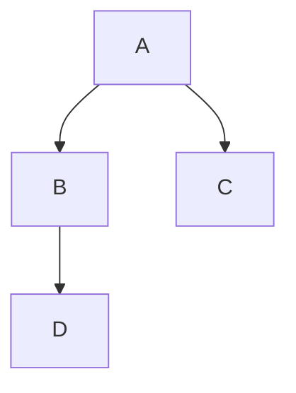

# L2 实验课程设计

#### 

垃圾

# L3 计算机体系结构概述

### 1.启动

#### 1.0 内存和硬盘布局

CPU，I/O设备，内存通过总线连接在一起

内存：

- RAM 随机访问存储，关机清空
- ROM **只读**存储，关机不清空，第一行代码从这里执行

BIOS：Basic Input Output System，作为固件，固化在内存的ROM中

#### 1.1 系统启动过程

- 系统加电，BIOS初始化
- 主引导记录
  - BIOS读取主引导扇区代码
- 活动分区引导扇区
  - 

### 中断、异常和系统调用

