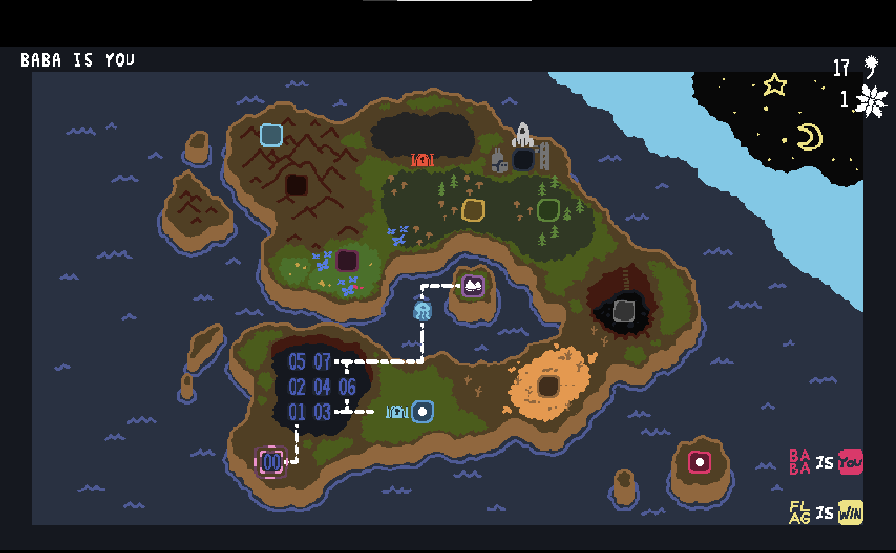
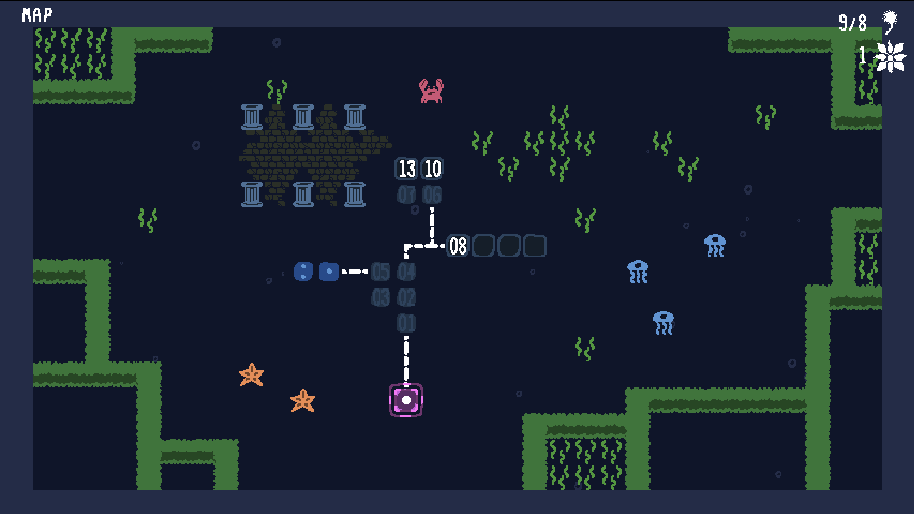
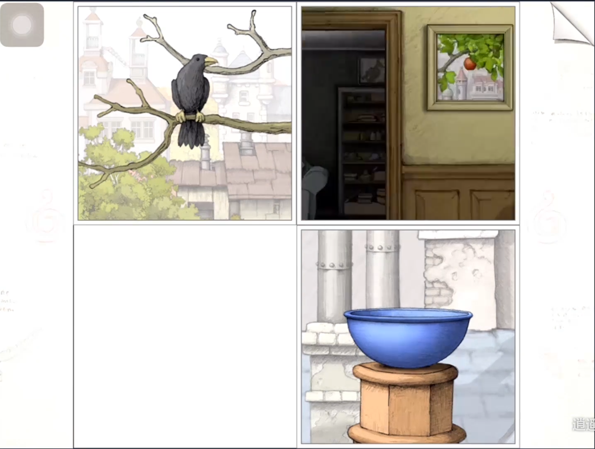
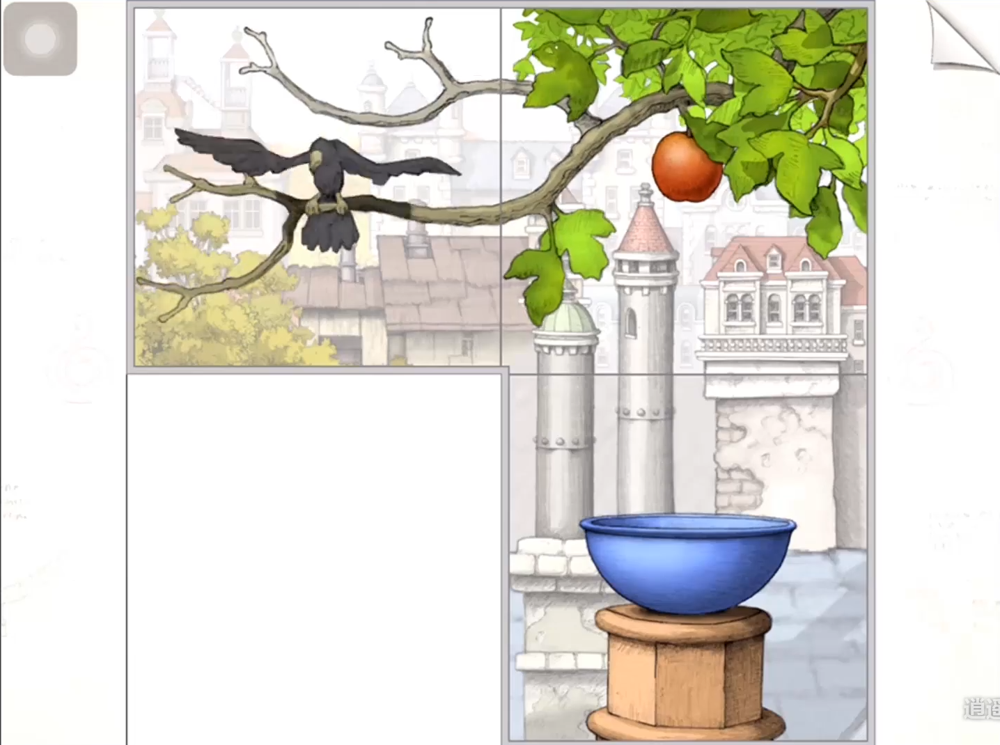

# 解谜游戏自适应提示系统

#### 自适应提示系统设计

##### 提示方式

- 问号按钮浮现，点击后显示提示
  - 可以是显示一行文本，也可以打开一个窗口播放视频，也可以在**游戏内容中插入图标/文字提示**
  - 实现方便的角度，显示一行文本

##### 提示内容

- 根据当前进度逐步显示，解决玩家燃眉之急，又不剧透太多
- 分段提示，开始可不直接给答案，而是带有一定启发性的提示，给玩家自己思考的空间

**数据采集**

- 视频捕捉游戏画面，判断玩家目前游戏阶段，匹配提示内容
- 眼动仪判断玩家是否专注，辅助判断情绪
- 摄像头监测玩家情绪，积极、消极、不耐烦
- 鼠标/键盘监测玩家操作频率，过高或过低

**提示判断条件**

- 游戏进入一个场景/到达一个阶段，停留时间过长
  - gorogoa 两分钟
  - the room2 三分钟
  - baba is you 五分钟
- 眼动：玩家专注解谜/频繁扫视
- 情绪：情绪消极，不耐烦
- 操作：频率过高一通乱按/频率过低不知道干嘛

### 2021.12.22

#### 问题

找了朋友帮忙测试

七八个解谜游戏

时间：卡关时间难以确定

不同难度的游戏怎么考量

简单游戏不需要提升

需要提示多少次

#### Baba is you 

推箱子解谜，游戏本身无提示系统，难度较大

**教学关 00-07**：10 min，难度较低，不太会卡关

解谜关键点：

01：wall is stop 可以拆

02：flag is stop

03：sink：两个一起消失，win 可以是 rock

04：death 出现

*05：hot 和 melt，lava is push

06：wall is you，有 death

07：文字可以竖着，只有一个 is

**Lake 01 - 05**：10 min，不太会卡关。01、02、03 难度不大，不是后面必须的教程，考虑省略

​	解谜关键点：

​		01：and，wall and baba is you，sink

​		*02：sink 利用，除掉骷髅

​		03：move

​		**04**：推进死亡圈，变成baba

​		**05**：baba is you，baba is win

**Lake 附加关，·  和  ：**：20 ~ 50 min

​		解谜关键点：

​			***骰子  ·  ：rock 不是 push 的时候可以踩；rock is you，baba is you，让rock先进去；baba 再推flag

​			**************骰子  :  : 

#### 画中世界

鼠标拖拽点击，游戏本体无步骤提示系统，有可点击位置提示。难度中等，解谜略无厘头，脑洞大

红苹果：5 - 10 min，教学关，难度较低，不太会卡关，不需要提示

绿苹果：10 - 15 min，难度中等，可能会卡关，可能需要提示，【考虑跳过】

黄苹果：15 - 30 min，难度较高，卡关概率较大，需要提示

#### The Room 2

密室逃脱 + 机关机密，鼠标点击拖拽，游戏本体有按时间解锁的提示系统

有恐怖元素

**第一关**：8min，教程，没有看提示

**第二关船舱**：  44mnin，六次提示，两三次运气好，难度中等

宝箱旁边金属柱

船 密码

抛锚模型位置

航海经线仪 翻转

航海经线仪 左边箱子

箱子边缘 钥匙孔

**第三关：**

35min 

钥匙位置

锤子的头

镜子密码

射击沙袋

金属外形嵌入小盒子

#### 银河历险记3

一关所需时间太长，一小时左右，且无明确流程，教学时间太长

#### 传送门2

教学时间太长，一小时以内难以过完足够的教学， 来到较为困难的关卡

#### 传统解谜游戏提示方式

- 固定时间解锁提示
- 花钱买提示
- 没有提示
- 花游戏币买提示
- 玩一个小游戏，成功后解锁提示
- 提示一直都在，可以随时点击
- 降低游戏难度，重要物品一直高亮/按住某些按键高亮

#### 自适应提示系统

通过一些数据，判断玩家状态，自动给出提示

##### 数据

- 眼动数据
- 情绪监测
- 玩家行动
  - 鼠标输入
  - 键盘输入
  - 游戏手柄

##### 游戏源

- 自己开发
- 开源游戏
- 商业游戏

#### 论文 review

##### 实验过程

1. 实验者随时可通过专门的按钮来请求帮助，记录并分析他们的行为，判断玩家什么时候遇到困难，需要帮助
2. 创造并执行适应性帮助系统，在玩家陷入困境之前提供提示，比较适应性帮助系统对玩家体验和学习结果的影响

##### 贡献

- 教育VR游戏中玩家行为的游戏进程评估
- 使用这种评估方式，提出自适应提示系统
- Social Engineer 游戏

##### Future work

- 评估不同进度指标的价值
- 评估适应性提示系统对玩家体验和学习结果的影响

##### 游戏内容 社会工程师

- 自己设计开发，模拟受到网络攻击时正确的反应

Todo

- 看[3]参考文献：自适应提示可能产生负面影响
- 想法：提示阶段细化，提示进度自动推进于玩家关注频繁的地方
- 

1. 问卷前期调研

受试者划分不同群体，进行讨论

觉得提示是否有必要

解谜游戏卡住怎么办，搜攻略？

2. 怎么构建自适应提示系统

3. 看全一些相关论文

只能辅导系统中，学生并不能很好的判断自己什么时候需要帮助。他们遇到困难后通常卡很长时间才点击提示，并只看最浅显的提示。

[1] Aleven, Vincent , and  K. R. Koedinger . "Limitations of Student Control: Do Students Know When They Need Help?." Springer-Verlag (2000).

James Gee认为，在用户熟悉了基本的界面元素并提出了具体的问题之后，按需访问手册是最有效的  

[2] J. P. Gee. Learning by design: Games as learning machines. Interactive Educational Multimedia, 8:15–23, 2004.

我们考虑的另一个特性是教程的上下文敏感性。 现有的教程可以分为两类:一类是在应用程序界面内提供与上下文相关的建议，另一类是在应用程序上下文之外提供文档。 HCI研究人员已经广泛研究了这两种类型的教程; 然而，情境敏感性对教程成功的影响尚不清楚，现有文献也没有显示出对这两种信息的明显偏好。  

历史上，教程主要是通过在应用程序上下文之外访问的文本文档提供的。 虽然纸质手册和在线文档只需要很少的资源来生成，但它们给用户带来了许多挑战，当用户在教程和应用程序之间切换时，他们很难跟踪说明[1,15,17]。 因此，许多研究人员通过将屏幕截图、图形、动画和注释整合到文本内容中来改进外部软件文档[9,12,13,21]。  

尽管有这些改进，许多研究人员认为上下文相关的教程有更大的潜力来提高应用的可学习性[4,14,10]。 这一观点得到了情境学习的支持，情境学习是一种在教育中流行的学习模式，它基于教学概念，在相同的环境中，它们将被应用于[18]。 游戏专家James Gee也强调了在玩家需要使用新机制之前教授新机制的重要性，而不是在没有背景的情况下呈现它们。 工具提示(当用户将鼠标悬停在界面组件上时提供简短的文本帮助)是上下文帮助[6]最成功的形式之一。 另一方面，上下文相关的帮助可能更令人沮丧  

提供一个帮助按钮，让玩家按自己的需求点击帮助，只在较为复杂的游戏中有作用；可能损害玩家解决问题的积极性，减少游玩时间。

[3] Okopny, P. ,  I. Musabirov , and  D  Alexandrov. "Informal In-Game Help Practices in Massive Multiplayer Online Games." International Conference on Social Informatics Springer International Publishing, 2014.

比较三种游戏

有固定时间提示的游戏，如笼中窥梦

无提示的游戏，如baba is you，传送门2

不同游戏难度

简单，中等，困难

不同提示形式

屏幕中提示

提示按钮，点击打开提示

额外的窗口显示提示

#### 大纲

#### Abstract

#### Introduction

介绍游戏提示系统的现状

目前的工作

- 找方向，原来的方向：检测解谜游戏玩家心理活动，给出游戏设计反馈理由
  - 游戏涉及推理，解谜等多个心理历程，难以用现有数据给出解释
  - 只能粗略估计玩家凝视-行动的间隔时间，给出时间统计，对游戏设计反馈性价比较低
- 新方向：自适应提示系统
  - 基于眼动活动，和情感检测等，开发模块，判断玩家情感状态

#### relative work + 假设

1. 玩家不能判断自己什么时候需要帮助
2. 按需帮助不是最有效的
3. 限制玩家自由的教程会带来负面体验
4. 上下文中呈现的说明，比脱离情景更有效，控制变量

#### 研究方法

##### 选中的游戏

- baba is you
- 传送门2
- 时空幻境

变量：

提示形式：无提示，点击提示，文本内提示

提示显示时间：随时显示，固定时间显示，自适应显示

关卡难度：简单，中等，复杂

##### 实验过程

1. 先让一批玩家玩游戏，收集眼动数据、鼠标数据和情绪数据，分析遇到困难的表现
2. 开发自适应提示系统
3. 收集玩家数据，对比有无自适应提示的效果，控制关卡难度和提示形式的变量

##### 玩家选择

寻找未玩过该游戏的玩家，问卷收集不同玩家的游戏水平

##### future work

这项研究也可以应用到游戏教程系统中，在适当的时间，给予玩家提示，比强迫性提示

智能教辅系统中起到帮助

